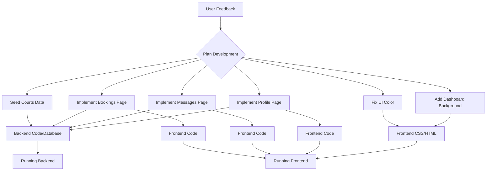

# Tennis Court Reserve Project Analysis and Strategy

This document outlines the plan to address identified issues and implement new features in the Tennis Court Reserve application.

## Confirmed Plan

Based on user feedback, the following tasks will be undertaken:

**Phase 1: Backend Stability and Data**

1.  **Seed Database with Example Courts:** To address the "error connecting to server" on the courts page, which is likely due to a lack of court data, we will add 4 example court entries to the database. This will involve examining and potentially modifying the existing seeding script ([`backend/src/seed.py`](backend/src/seed.py)) and running it.

**Phase 2: Frontend Feature Implementation**

2.  **Implement Booking Page:**
    *   Ensure the backend API endpoint for fetching user bookings is functional.
    *   Modify the frontend booking page ([`frontend/my_bookings.html`](frontend/my_bookings.html) or [`frontend/manage_bookings.html`](frontend/manage_bookings.html)) to fetch booking data from the backend.
    *   Update the page to display the list of bookings or a message indicating "no bookings currently" if the list is empty.
3.  **Implement Messages Page:**
    *   Ensure the backend API endpoint for fetching user messages is functional.
    *   Modify the frontend messages page ([`frontend/messages.html`](frontend/messages.html)) to fetch message data from the backend.
    *   Update the page to display the list of messages or a message indicating "no messages currently" if the list is empty.
4.  **Implement Profile Page:**
    *   Ensure the backend API endpoint for fetching user profile information is functional.
    *   Modify the frontend profile page ([`frontend/profile.html`](frontend/profile.html)) to fetch and display the logged-in user's profile details from the backend.

**Phase 3: Frontend UI Improvements**

5.  **Fix "Find and Book a Court" Color:** We will identify the CSS rule responsible for the background color of the "find and book a court" section (likely in [`frontend/common_styles.css`](frontend/common_styles.css) or [`frontend/dashboard.html`](frontend/dashboard.html)) and change it to the correct green color.
6.  **Add Nadal Background to Dashboard:** We will add a background image of Nadal on a tennis court to the dashboard page ([`frontend/dashboard.html`](frontend/dashboard.html)). This will involve adding a CSS rule, likely in [`frontend/common_styles.css`](frontend/common_styles.css), to set the background image. We will need a suitable image URL or file for this step.

## Future Enhancements / TODOs

The following items represent a broader list of tasks for future development and refinement:

### Enhance UI/UX:
*   Replace all placeholder elements and improve the overall visual design and user experience.
*   Implement the interactive calendar view (currently blocked by backend capabilities for month-wide availability data).
*   Complete the user profile page (largely done with view and edit functionality).
*   Add advanced filtering functionality on the court listing page that interacts with the backend (Frontend and Backend for basic filters implemented).

### Refine Backend Logic:
*   Address the notification parameter inconsistency (addressed for `bookings_bp.py`).
*   Ensure consistent notification triggering across all relevant actions (addressed for `trainer.py`).
*   Review and potentially refactor the generic user CRUD routes for admin capabilities and to avoid conflicts (addressed by adding admin protection).
*   Add more comprehensive backend validation and error handling (enhanced for booking creation).

### Testing:
*   Implement automated tests (unit, integration, end-to-end) to ensure the stability and correctness of the application as new features are added and existing ones are refined.